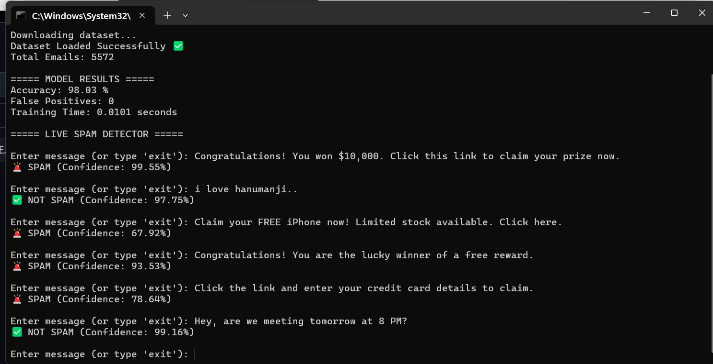

# Spam Classifier ML 🚀

## 📌 Project Description

This project is a Machine Learning-based Spam Classifier that predicts whether a message/email is Spam or Not Spam using Natural Language Processing (NLP) techniques and classification algorithms.

## 🛠 Technologies Used

* Python
* Scikit-learn
* NLP
* Pandas
* NumPy
* Machine Learning Algorithms

## 📊 Project Workflow

1. Data Preprocessing
2. Text Cleaning
3. Feature Extraction
4. Model Training
5. Prediction

## 📸 Screenshots
### Output




```bash
pip install -r requirements.txt
python spam_classifier.py
```

---

⭐ If you like this project, give the repository a star!

